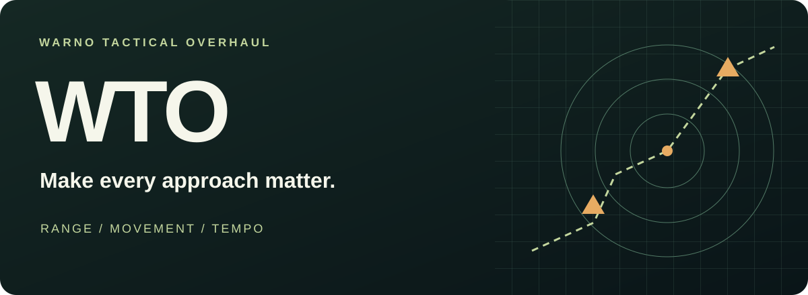

# Make every approach matter.

**WARNO Tactical Overhaul reshapes engagement ranges, movement, vision, and weapon behavior.**

[**Play on Steam**](https://steamcommunity.com/sharedfiles/filedetails/?id=3387658237) · [**Customize your build**](docs/README.md) · [**Get the source package**](https://github.com/Yokaiste/WTO/releases/latest)

---

## A different rhythm of battle

Longer reach changes where an engagement begins. Revised movement and vision change how you approach it. WTO brings those rules together across the roster, with tuning you can adjust for your own local build.

| 🎯 Engagements                                                                   | 🧭 Movement & vision                                                          | ⏱️ Weapon timing                                                                  |
| -------------------------------------------------------------------------------- | ----------------------------------------------------------------------------- | --------------------------------------------------------------------------------- |
| Reworked ammunition and missile ranges change the space between opposing forces. | Road speeds and sight ranges reshape routes, positioning, and reconnaissance. | Projectile speeds, missile flight, and engagement cycles change how weapons feel. |

## Your preferred balance, in one place

The source package keeps tuning together: ranges, movement, vision, artillery behavior, and selected weapon adjustments. Change only the values you want; the rest retain their defaults.

**Pair it with YSM.** The included installer sets up both packages. WTO applies after YSM, bringing its balance pass to the expanded sandbox. It can also be built on its own against compatible WARNO mod data.

[Explore setup and customization →](docs/README.md)

## Built to inspect and adjust

Powered by [YMB](https://github.com/Yokaiste/YMB), WTO is a collection of readable patches. Preview the result before applying it, keep local settings through installer updates, and recover the original files when you want to undo a sync.

## Credits

- Owner and original WTO author: [ShadowofChernobyl](https://steamcommunity.com/id/ShadowofCherno/)
- Built with [YMB](https://github.com/Yokaiste/YMB)

## License

This source repository is available under the [MIT License](LICENSE).
WARNO and its original game assets remain the property of Eugen Systems and are
not relicensed by this repository.
